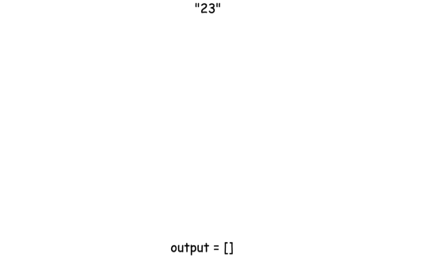

# 题目0017:电话号码的字母组合

## 题目描述

给定一个仅包含数字2-9的字符串,返回所有它能表示的字母组合。

给出数字到字母的映射如下(与电话按键相同)。注意1不对应任何字母。


示例:

```
输入："23"
输出：["ad", "ae", "af", "bd", "be", "bf", "cd", "ce", "cf"].
```

说明:尽管上面的答案是按字典序排列的,但是你可以任意选择答案输出的顺序。

## 解题技巧

* **方法:回溯**

回溯是一种通过穷举所有可能情况来找到所有解的算法。如果一个候选解最后被发现并不是可行解,回溯算法会舍弃它,并在前面的一些步骤做出一些修改,并重新尝试找到可行解。

给出如下回溯函数backtrack(combination, next_digits),它将一个目前已经产生的组合combination和接下来准备要输入的数字next_digits作为参数。

> - 如果没有更多的数字需要被输入,那意味着当前的组合已经产生好了。
> - 如果还有数字需要被输入:
>   + 遍历下一个数字所对应的所有映射的字母。
>   + 将当前的字母添加到组合最后,也就是combination = combination + letter 。
>   + 重复这个过程,输入剩下的数字:backtrack(combination + letter, next_digits[1:]) 。



```python
class Solution:
    def letterCombinations(self, digits):
        """
        :type digits: str
        :rtype: List[str]
        """
        phone = {'2': ['a', 'b', 'c'],
                 '3': ['d', 'e', 'f'],
                 '4': ['g', 'h', 'i'],
                 '5': ['j', 'k', 'l'],
                 '6': ['m', 'n', 'o'],
                 '7': ['p', 'q', 'r', 's'],
                 '8': ['t', 'u', 'v'],
                 '9': ['w', 'x', 'y', 'z']}
                
        def backtrack(combination, next_digits):
            # if there is no more digits to check
            if len(next_digits) == 0:
                # the combination is done
                output.append(combination)
            # if there are still digits to check
            else:
                # iterate over all letters which map 
                # the next available digit
                for letter in phone[next_digits[0]]:
                    # append the current letter to the combination
                    # and proceed to the next digits
                    backtrack(combination + letter, next_digits[1:])
                    
        output = []
        if digits:
            backtrack("", digits)
        return output
```

复杂度分析

> 时间复杂度:$O(3^N \times 4^M)$,其中N是输入数字中对应3个字母的数目(比方说2,3,4,5,6,8),M是输入数字中对应4个字母的数目(比方说7,9),N+M是输入数字的总数。
>
> 空间复杂度:$O(3^N \times 4^M)$,这是因为需要保存$3^N \times 4^M$个结果。
