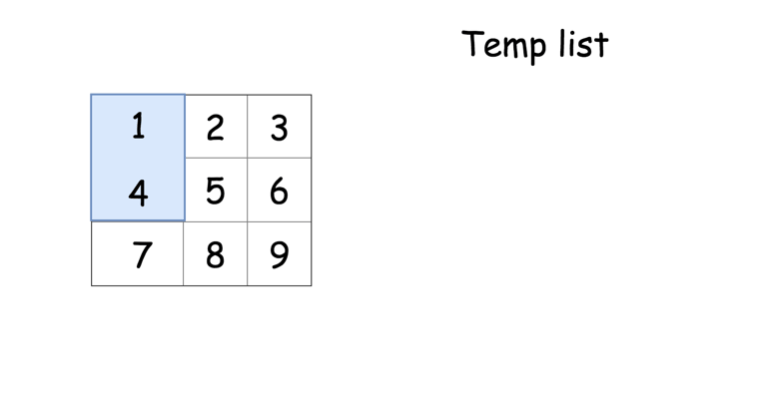

# 题目0048:旋转图像
## 题目描述

给定一个n×n的二维矩阵表示一个图像。将图像顺时针旋转90度。

说明:你必须在原地旋转图像,这意味着你需要直接修改输入的二维矩阵。请不要使用另一个矩阵来旋转图像。

示例1:

```
给定 matrix = 
[
  [1,2,3],
  [4,5,6],
  [7,8,9]
],

原地旋转输入矩阵，使其变为:
[
  [7,4,1],
  [8,5,2],
  [9,6,3]
]
```

示例2:

```
给定 matrix =
[
  [ 5, 1, 9,11],
  [ 2, 4, 8,10],
  [13, 3, 6, 7],
  [15,14,12,16]
], 

原地旋转输入矩阵，使其变为:
[
  [15,13, 2, 5],
  [14, 3, 4, 1],
  [12, 6, 8, 9],
  [16, 7,10,11]
]
```


## 解题技巧

* **方法1:转置加翻转**

最直接的想法是先转置矩阵,然后翻转每一行。这个简单的方法已经能达到最优的时间复杂度$O(N^2)$。

```python
class Solution:
    def rotate(self, matrix):
        """
        :type matrix: List[List[int]]
        :rtype: void Do not return anything, modify matrix in-place instead.
        """
        n = len(matrix[0])        
        # transpose matrix
        for i in range(n):
            for j in range(i, n):
                matrix[j][i], matrix[i][j] = matrix[i][j], matrix[j][i] 
        
        # reverse each row
        for i in range(n):
            matrix[i].reverse()
```

算法复杂度:

> 时间复杂度:$O(N^2)$.
> 
> 空间复杂度:O(1),由于旋转操作是就地完成的。

* **方法2:旋转四个矩形**

直观想法:方法1使用了两次矩阵操作,但是有只使用一次操作的方法完成旋转。

为了实现这一点,我们来研究每个元素在旋转的过程中如何移动。


这提供给我们了一个思路,将给定的矩阵分成四个矩形并且将原问题划归为旋转这些矩形的问题。


现在的解法很直接-可以在第一个矩形中移动元素并且在长度为4个元素的临时列表中移动它们。



```python
class Solution:
    def rotate(self, matrix):
        """
        :type matrix: List[List[int]]
        :rtype: void Do not return anything, modify matrix in-place instead.
        """
        n = len(matrix[0])
        for i in range(n // 2 + n % 2):
            for j in range(n // 2):
                tmp = [0] * 4
                row, col = i, j
                # store 4 elements in tmp
                for k in range(4):
                    tmp[k] = matrix[row][col]
                    row, col = col, n - 1 - row
                # rotate 4 elements   
                for k in range(4):
                    matrix[row][col] = tmp[(k - 1) % 4]
                    row, col = col, n - 1 - row
```

复杂度分析

> 时间复杂度:$O(N^2)$是两重循环的复杂度。
> 
> 空间复杂度:O(1),由于我们在一次循环中的操作是就地完成的,并且我们只用了长度为4的临时列表做辅助。

* **方法3:在单次循环中旋转4个矩形**

该想法和方法2相同,但是所有的操作可以在单次循环内完成并且这是更精简的方法。

```python
class Solution:
    def rotate(self, matrix):
        """
        :type matrix: List[List[int]]
        :rtype: void Do not return anything, modify matrix in-place instead.
        """
        n = len(matrix[0])        
        for i in range(n // 2 + n % 2):
            for j in range(n // 2):
                tmp = matrix[n - 1 - j][i]
                matrix[n - 1 - j][i] = matrix[n - 1 - i][n - j - 1]
                matrix[n - 1 - i][n - j - 1] = matrix[j][n - 1 -i]
                matrix[j][n - 1 - i] = matrix[i][j]
                matrix[i][j] = tmp
```

复杂度分析:

> 时间复杂度:$O(N^2)$是两重循环的复杂度。
> 
> 空间复杂度:$O(1)$由于旋转操作是就地完成的。