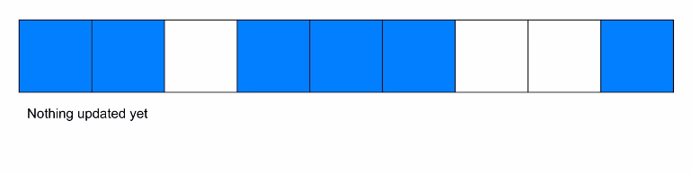
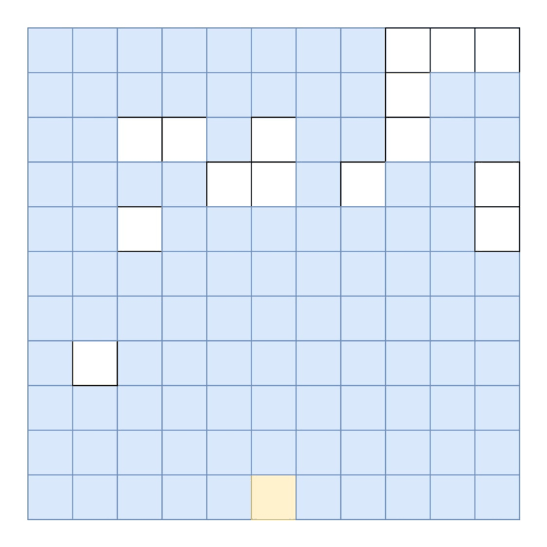

# 题目0085:最大矩形

## 题目描述

给定一个仅包含0和1的二维二进制矩阵,找出只包含1的最大矩形,并返回其面积。

示例:

```
输入:
[
  ["1","0","1","0","0"],
  ["1","0","1","1","1"],
  ["1","1","1","1","1"],
  ["1","0","0","1","0"]
]
输出: 6
```


## 解题技巧

* **方法一:暴力算法**

最原始地,我们可以列举每个可能的矩形。这可以通过遍历所有的(x1, y1) (x2, y2)坐标,并以它们为对角顶点来完成。该方法过慢,不足以通过所有测试用例。

复杂度分析

> 时间复杂度:$O(N^3M^3)$,其中N为行数,M为列数。遍历全部坐标的复杂度是$O(N^2M^2)$,遍历以该两点为对角顶点的矩形又会耗费O(NM)。故总体复杂度为$O(NM) * O(N^2M^2) = O(N^3M^3)$。
>
> 空间复杂度:O(1).

* **方法二:动态规划-使用柱状图的优化暴力方法**

我们可以以常数时间计算出在给定的坐标结束的矩形的最大宽度。我们可以通过记录每一行中每一个方块连续的“1”的数量来实现这一点。每遍历完一行,就更新该点的最大可能宽度。通过以下代码即可实现。 row[i] = row[i - 1] + 1 if row[i] == '1'.



一旦我们知道了每个点对应的最大宽度,我们就可以在线性时间内计算出以该点为右下角的最大矩形。当我们遍历列时,可知从初始点到当前点矩形的最大宽度,就是我们遇到的每个最大宽度的最小值。

我们定义:

```
maxWidth = min(maxWidth, widthHere)
curArea = maxWidth * (curre***ow - originalRow + 1)
maxArea = max(maxArea, curArea)
```

下面的动画有助于理解。给定每个点的最大宽度，可计算出底端黄色方块的最大矩形面积。


对每个点重复这一过程,就可以得到全局最大。

注意,我们预计算最大宽度的方法事实上将输入转化成了一系列的柱状图,每一栏是一个新的柱状图。我们在针对每个柱状图计算最大面积。


于是,上述方法本质上是84-柱状图中最大的矩形题中优化暴力算法的复用。

```python
class Solution:
    def maximalRectangle(self, matrix: List[List[str]]) -> int:
        maxarea = 0

        dp = [[0] * len(matrix[0]) for _ in range(len(matrix))]
        for i in range(len(matrix)):
            for j in range(len(matrix[0])):
                if matrix[i][j] == '0': continue

                # compute the maximum width and update dp with it
                width = dp[i][j] = dp[i][j-1] + 1 if j else 1

                # compute the maximum area rectangle with a lower right corner at [i, j]
                for k in range(i, -1, -1):
                    width = min(width, dp[k][j])
                    maxarea = max(maxarea, width * (i-k+1))
        return maxarea
```

复杂度分析

> 时间复杂度:$O(N^2M)$。由于需要遍历同一列中的值,计算每个点对应最大面积需要O(N)。对全部$N * M$点都要计算,因此总共$O(N) * O(NM) = O(N^2M)$。
>
> 空间复杂度:O(NM)。我们分配了一个等大的数组,用于存储每个点的最大宽度。

* **方法三:使用柱状图-栈**

在上一方法中我们讨论了将输入拆分成一系列的柱状图,每个柱状图代表一列的子结构。为了计算长方形的最大面积,我们仅仅需要计算每个柱状图中的最大面积并找到全局最大值(注意后面的解法对每一行而非列建立了柱状图,两者思想一致)。

既然我们已经有了84-柱状图中最大的矩形,可以直接使用该题题解中最快的基于栈的解法[点击这里](https://leetcode-cn.com/problems/largest-rectangle-in-histogram/solution/),并将其应用在我们生成的柱状图中。想详细了解该算法的原理,请点击上面的链接。

```python
class Solution:

    # Get the maximum area in a histogram given its heights
    def leetcode84(self, heights):
        stack = [-1]

        maxarea = 0
        for i in range(len(heights)):

            while stack[-1] != -1 and heights[stack[-1]] >= heights[i]:
                maxarea = max(maxarea, heights[stack.pop()] * (i - stack[-1] - 1))
            stack.append(i)

        while stack[-1] != -1:
            maxarea = max(maxarea, heights[stack.pop()] * (len(heights) - stack[-1] - 1))
        return maxarea


    def maximalRectangle(self, matrix: List[List[str]]) -> int:

        if not matrix: return 0

        maxarea = 0
        dp = [0] * len(matrix[0])
        for i in range(len(matrix)):
            for j in range(len(matrix[0])):

                # update the state of this row's histogram using the last row's histogram
                # by keeping track of the number of consecutive ones

                dp[j] = dp[j] + 1 if matrix[i][j] == '1' else 0

            # update maxarea with the maximum area from this row's histogram
            maxarea = max(maxarea, self.leetcode84(dp))
        return maxarea
```

其中力扣84下的代码是从[84-柱状图中最大的矩形](https://leetcode-cn.com/problems/largest-rectangle-in-histogram/)的题解中复制来的。

复杂度分析

> 时间复杂度:O(NM)。对每一行运行力扣84需要M(每行长度)时间,运行了N次,共计O(NM)。
> 
> 空间复杂度:O(M)。我们声明了长度等于列数的数组,用于存储每一行的宽度。

* **方法四：动态规划-每个点的最大高度**

想象一个算法,对于每个点我们会通过以下步骤计算一个矩形:

> 不断向上方遍历,直到遇到“0”,以此找到矩形的最大高度。
> 
> 向左右两边扩展,直到无法容纳矩形最大高度。

例如,找到黄色点对应的矩形:



我们知道,最大矩形必为用这种方式构建的矩形之一。

给定一个最大矩形,其高为h,左边界l,右边界r,在矩形的底边,区间[l, r]内必然存在一点,其上连续1的个数(高度)<=h。若该点存在,则由于边界内的高度必能容纳h,以上述方法定义的矩形会向上延伸到高度h,再左右扩展到边界[l, r],于是该矩形就是最大矩形。

若不存在这样的点,则由于[l, r]内所有的高度均大于h,可以通过延伸高度来生成更大的矩形,因此该矩形不可能最大。

综上,对于每个点,只需要计算h,l和r-矩形的高,左边界和右边界。

使用动态规划,我们可以在线性时间内用上一行每个点的h,l和r计算出下一行每个点的的h,l和r。

算法:给定一行matrix[i],我们通过定义三个数组height,left和right来记录每个点的h,l和r。height[j]对应matrix[i][j]的高,以此类推。

问题转化为如何更新每个数组。

Height:

这个比较容易,h的定义是从该点出发连续的1的个数。我们从方法二中已经学会了在一行中计算的方法:`row[j] = row[j - 1] + 1 if row[j] == '1'`

只需要一点改动即可:`new_height[j] = old_height[j] + 1 if row[j] == '1' else 0`

Left:

考虑哪些因素会导致矩形左边界的改变。由于当前行之上的全部0已经考虑在当前版本的left中,唯一能影响left就是在当前行遇到0。

因此我们可以定义:`new_left[j] = max(old_left[j], cur_left)`。

cur_left是我们遇到的最右边的0的序号加1。当我们将矩形向左"扩展",我们知道,不能超过该点,否则会遇到0。

Right:

我们可以沿用left的思路,定义:`new_right[j] = min(old_right[j], cur_right)`。

cur_right是我们遇到的最左边的0的序号。简便起见，我们不把cur_right减去1(就像我们给cur_left加上1那样)，这样我们就可以用height[j] * (right[j] - left[j])而非height[j] * (right[j] + 1 - left[j])来计算矩形面积。

这意味着,严格地说,矩形的底边由半开半闭区间[l, r) 决定,而非闭区间[l, r],且 right比右边界大1。尽管不这样做算法也可以正确运行,但这样会让计算看起来更简洁。

注意,为了正确的记录cur_right,我们需要从右向左迭代。因此,更新right时需要从右向左。

一旦left,right和height数组能够正确更新,我们就只需要计算每个矩形的面积。

由于我们知道矩形j的边界和高,可以简单地用height[j] * (right[j] - left[j])来计算面积,若j的面积 大于max_area,则更新之。

```python
class Solution:

    def maximalRectangle(self, matrix: List[List[str]]) -> int:
        if not matrix: return 0

        m = len(matrix)
        n = len(matrix[0])

        left = [0] * n # initialize left as the leftmost boundary possible
        right = [n] * n # initialize right as the rightmost boundary possible
        height = [0] * n

        maxarea = 0

        for i in range(m):

            cur_left, cur_right = 0, n
            # update height
            for j in range(n):
                if matrix[i][j] == '1': height[j] += 1
                else: height[j] = 0
            # update left
            for j in range(n):
                if matrix[i][j] == '1': left[j] = max(left[j], cur_left)
                else:
                    left[j] = 0
                    cur_left = j + 1
            # update right
            for j in range(n-1, -1, -1):
                if matrix[i][j] == '1': right[j] = min(right[j], cur_right)
                else:
                    right[j] = n
                    cur_right = j
            # update the area
            for j in range(n):
                maxarea = max(maxarea, height[j] * (right[j] - left[j]))

        return maxarea
```

复杂度分析

> 时间复杂度:O(NM)。每次对于N的迭代我们会对M迭代常数次。
>
> 空间复杂度:O(M),M是我们保留的额外数组的长度。