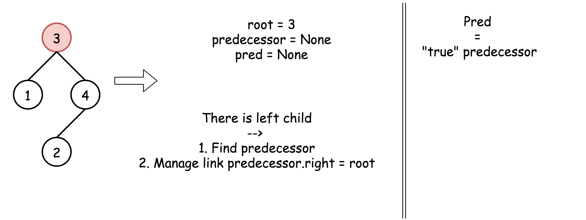

# 题目0099:恢复二叉搜索树

## 题目描述

二叉搜索树中的两个节点被错误地交换。

请在不改变其结构的情况下,恢复这棵树。

示例1:

```
输入: [1,3,null,null,2]

   1
  /
 3
  \
   2

输出: [3,1,null,null,2]

   3
  /
 1
  \
   2
```

示例2:

```
输入: [3,1,4,null,null,2]

  3
 / \
1   4
   /
  2

输出: [2,1,4,null,null,3]

  2
 / \
1   4
   /
  3
```

进阶:

> 使用O(n)空间复杂度的解法很容易实现。
> 
> 你能想出一个只使用常数空间的解决方案吗？

## 解题技巧

* **方法一:对数组进行排序**

让我们从直截了当但却不是最优的解决方案开始。这个解决方案具有线性的时间和空间复杂性。

我们直到BST的中序遍历是升序序列。下面展示了如何计算中序遍历。

```python
# Definition for a binary tree node.
# class TreeNode(object):
#     def __init__(self, val=0, left=None, right=None):
#         self.val = val
#         self.left = left
#         self.right = right
def inorder(r: TreeNode) -> List[int]:
    return inorder(r.left) + [r.val] + inorder(r.right) if r else []
```

这里被交换了两个节点,因此中序遍历是一个几乎排好序的数组,其中有两个元素被交换。识别排序数组中两个交换元素是可以在线性时间内解决的经典问题。

```python
def find_two_swapped(nums: List[int]) -> (int, int):
    n = len(nums)
    x = y = -1
    for i in range(n - 1):
        if nums[i + 1] < nums[i]:
            y = nums[i + 1]
            # first swap occurence
            if x == -1:     
                x = nums[i]
            # second swap occurence
            else:           
                break
    return x, y
```

当已知两个交换节点，再次遍历树，交换该节点的值。

算法:

> 按中序遍历树。遍历后的数组应该是几乎排序的列表,其中只有两个元素被交换。
> 
> 在线性时间内确定几乎排序数组中的两个交换元素x和y。
> 
> 再次遍历树,将值x的节点改为y,将值y的节点改为x。

```python
class Solution:
    def recoverTree(self, root: TreeNode):
        """
        :rtype: void Do not return anything, modify root in-place instead.
        """
        def inorder(r: TreeNode) -> List[int]:
            return inorder(r.left) + [r.val] + inorder(r.right) if r else []
        
        def find_two_swapped(nums: List[int]) -> (int, int):
            n = len(nums)
            x = y = -1
            for i in range(n - 1):
                if nums[i + 1] < nums[i]:
                    y = nums[i + 1]
                    # first swap occurence
                    if x == -1:     
                        x = nums[i]
                    # second swap occurence
                    else:           
                        break
            return x, y
        
        def recover(r: TreeNode, count: int):
            if r:
                if r.val == x or r.val == y:
                    r.val = y if r.val == x else x
                    count -= 1
                    if count == 0:
                        return      
                recover(r.left, count)
                recover(r.right, count)
            
        nums = inorder(root)
        x, y = find_two_swapped(nums)
        recover(root, 2)
```
复杂度分析

> 时间复杂度:$\mathcal{O}(N)$。中序遍历需要$\mathcal{O}(N)$的时间,判断两个交换节点:在最好的情况下是$\mathcal{O}(1)$,在最坏的情况下是$\mathcal{O}(N)$。
> 
> 空间复杂度:$\mathcal{O}(N)$,我们用nums数组保存了树的中序遍历列表。

* **方法二:迭代中序遍历**

算法:

在这里,我们通过迭代构造中序遍历,并在一次遍历中找到交换的节点。

迭代顺序很简单:尽可能的向左走,然后向右走一步,重复一直到结束。

若要找到交换的节点,就记录中序遍历中的最后一个节点pred(即当前节点的前置节点),并与当前节点的值进行比较。如果当前节点的值小于前置节点pred的值,说明该节点是交换节点之一。

交换的节点只有两个,因此在确定了第二个交换节点以后,可以终止遍历。

这样,就可以直接获取节点(而不仅仅是它们的值),从而实现$\mathcal{O}(1)$的交换时间,大大减少了步骤3所需的时间。


在java中用ArrayDeque代替栈。

```python
class Solution:
    def recoverTree(self, root: TreeNode):
        """
        :rtype: void Do not return anything, modify root in-place instead.
        """
        stack = []
        x = y = pred = None
        
        while stack or root:
            while root:
                stack.append(root)
                root = root.left
            root = stack.pop()
            if pred and root.val < pred.val:
                y = root
                if x is None:
                    x = pred 
                else:
                    break
            pred = root
            root = root.right

        x.val, y.val = y.val, x.val
```

复杂度分析

> 时间复杂度:最好的情况下是$\mathcal{O}(1)$;最坏的情况下是交换节点之一是最右边的叶节点时,此时是$\mathcal{O}(N)$。
> 
> 空间复杂度:最大是$\mathcal{O}(H)$来维持栈的大小,其中$H$指的是树的高度。

* **方法三:递归中序遍历**

算法：

方法二的迭代可以转换为递归方式。

递归中序遍历很简单:遵循Left->Node->Right方向,即对左子节点进行递归调用,然后判断该节点是否被交换,然后对右子节点执行递归调用。

```python
class Solution:
    def recoverTree(self, root):
        """
        :type root: TreeNode
        :rtype: void Do not return anything, modify root in-place instead.
        """
        def find_two_swapped(root: TreeNode):
            nonlocal x, y, pred
            if root is None:
                return
            
            find_two_swapped(root.left)
            if pred and root.val < pred.val:
                y = root
                # first swap occurence
                if x is None:
                    x = pred 
                # second swap occurence
                else:
                    return
            pred = root
            find_two_swapped(root.right)
        
        x = y = pred = None
        find_two_swapped(root)
        x.val, y.val = y.val, x.val
```

复杂度分析

> 时间复杂度:最好的情况下是$\mathcal{O}(1)$;最坏的情况下是交换节点之一是最右边的叶节点时,此时是$\mathcal{O}(N)$。
> 空间复杂度:最大是$\mathcal{O}(H)$来维持递归调用堆栈的大小,其中$H$指的是树的高度。

* **方法四:Morris中序遍历**

算法:

我们已经讨论了迭代和递归中序遍历,但是这两种遍历尽管使用了$\mathcal{O}(H)$的空间去存储栈空间,但是都有较大的时间复杂度。我们可以通过牺牲性能来届生空间。

Morris的遍历思想很简单:只遍历树而不是用空间。

怎么能够做到呢?在每个节点上,你必须决定下一个遍历的方向:遍历左子树或者右子树。如果不适用额外的空间,怎么指的左子树已经遍历完成了呢?

Morris算法的思想是在节点和它的直接前驱之间设置一个临时的链接:predecessor.right=root,从该节点开始,找到它的直接前驱并验证是否存在链接。

> 如果没有链接,设置连接并走向左子树。
> 
> 如果有连接,断开连接并走向右子树。

这里有一个小问题要处理:如果该节点没有左孩子,即没有左子树,则我们直接走向右子树。



```python
class Solution:
    def recoverTree(self, root):
        """
        :type root: TreeNode
        :rtype: void Do not return anything, modify root in-place instead.
        """
        # predecessor is a Morris predecessor. 
        # In the 'loop' cases it could be equal to the node itself predecessor == root.
        # pred is a 'true' predecessor, 
        # the previous node in the inorder traversal.
        x = y = predecessor = pred = None
        
        while root:
            # If there is a left child
            # then compute the predecessor.
            # If there is no link predecessor.right = root --> set it.
            # If there is a link predecessor.right = root --> break it.
            if root.left:       
                # Predecessor node is one step left 
                # and then right till you can.
                predecessor = root.left
                while predecessor.right and predecessor.right != root:
                    predecessor = predecessor.right
 
                # set link predecessor.right = root
                # and go to explore left subtree
                if predecessor.right is None:
                    predecessor.right = root
                    root = root.left
                # break link predecessor.right = root
                # link is broken : time to change subtree and go right
                else:
                    # check for the swapped nodes
                    if pred and root.val < pred.val:
                        y = root
                        if x is None:
                            x = pred 
                    pred = root
                    
                    predecessor.right = None
                    root = root.right
            # If there is no left child
            # then just go right.
            else:
                # check for the swapped nodes
                if pred and root.val < pred.val:
                    y = root
                    if x is None:
                        x = pred 
                pred = root
                
                root = root.right
        
        x.val, y.val = y.val, x.val
```

复杂度分析:

> 时间复杂度:$\mathcal{O}(N)$,我们访问每个节点两次。
> 
> 空间复杂度:$\mathcal{O}(1)$。