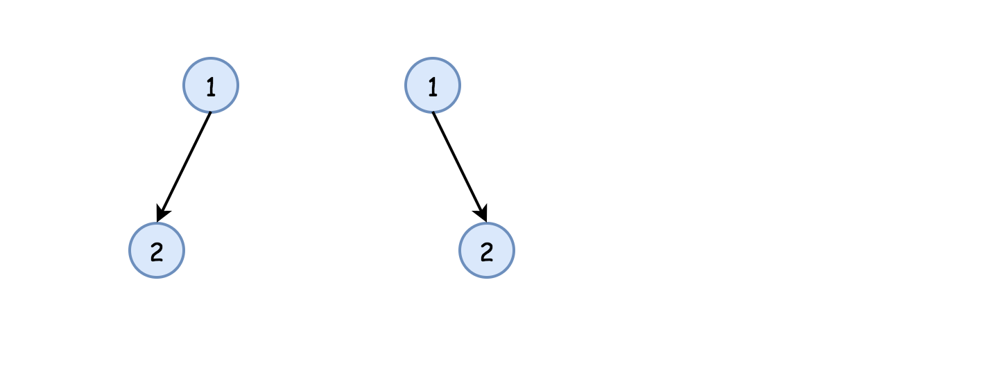

# 题目0100_相同的树

## 题目描述

给定两个二叉树,编写一个函数来检验它们是否相同。

如果两个树在结构上相同,并且节点具有相同的值,则认为它们是相同的。

示例 1:

```
输入:       1         1
          / \       / \
         2   3     2   3

        [1,2,3],   [1,2,3]
输出: true
```

示例2:

```
输入:      1          1
          /           \
         2             2

        [1,2],     [1,null,2]
输出: false
```

示例3:

```
输入:       1         1
          / \       / \
         2   1     1   2

        [1,2,1],   [1,1,2]
输出: false
```

## 解题技巧

* **方法一:递归**

最简单的策略是使用递归。首先判断p和q是不是None,然后判断它们的值是否相等。若以上判断通过,则递归对子结点做同样操作。

实现



```python
class Solution:
    def isSameTree(self, p, q):
        """
        :type p: TreeNode
        :type q: TreeNode
        :rtype: bool
        """    
        # p and q are both None
        if not p and not q:
            return True
        # one of p and q is None
        if not q or not p:
            return False
        if p.val != q.val:
            return False
        return self.isSameTree(p.right, q.right) and self.isSameTree(p.left, q.left)
```

复杂度分析:

> 时间复杂度:$O(N)$,其中$N$是树的结点数,因为每个结点都访问一次。
> 
> 空间复杂度:最优情况(完全平衡二叉树)时为$O(\log(N))$,最坏情况下(完全不平衡二叉树)时为${O}(N)$,用于维护递归栈。

* **方法二:迭代**

直觉:从根开始,每次迭代将当前结点从双向队列中弹出。然后,进行方法一中的判断:

> p和q不是 None,
> 
> p.val等于q.val,

若以上均满足,则压入子结点。

实现:

```python
from collections import deque
class Solution:
    def isSameTree(self, p, q):
        """
        :type p: TreeNode
        :type q: TreeNode
        :rtype: bool
        """    
        def check(p, q):
            # if both are None
            if not p and not q:
                return True
            # one of p and q is None
            if not q or not p:
                return False
            if p.val != q.val:
                return False
            return True
        
        deq = deque([(p, q),])
        while deq:
            p, q = deq.popleft()
            if not check(p, q):
                return False
            
            if p:
                deq.append((p.left, q.left))
                deq.append((p.right, q.right))
                    
        return True
```

复杂度分析:

> 时间复杂度:$O(N)$,其中$N$是树的结点数,因为每个结点都访问一次。
> 
> 空间复杂度: 最优情况(完全平衡二叉树)时为$O(\log(N))$,最坏情况下(完全不平衡二叉树)时为${O}(N)$,用于维护双向队列。