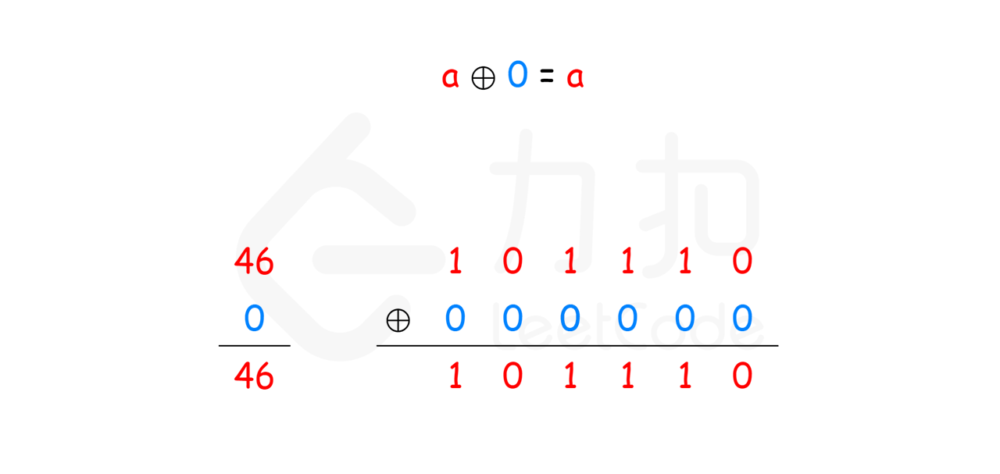

# 题目0136:只出现一次的数字

## 题目描述

给定一个非空整数数组,除了某个元素只出现一次以外,其余每个元素均出现两次。找出那个只出现了一次的元素。

说明:你的算法应该具有线性时间复杂度。 你可以不使用额外空间来实现吗?

示例 1:

```
输入: [2,2,1]
输出: 1
```

示例2:

```
输入: [4,1,2,1,2]
输出: 4
```

## 解题技巧

<video src="../images/b247ad41bdcb425990d482e06eb23e6935be2f5b68b96dbcd9dc4609c8203976.mp4" controls></video>

* **方法一:位运算**

如果没有时间复杂度和空间复杂度的限制,这道题有很多种解法,可能的解法有如下几种。

> * 使用集合存储数字。遍历数组中的每个数字,如果集合中没有该数字,则将该数字加入集合,如果集合中已经有该数字,则将该数字从集合中删除,最后剩下的数字就是只出现一次的数字。
> * 使用哈希表存储每个数字和该数字出现的次数。遍历数组即可得到每个数字出现的次数,并更新哈希表,最后遍历哈希表,得到只出现一次的数字。
> * 使用集合存储数组中出现的所有数字,并计算数组中的元素之和。由于集合保证元素无重复,因此计算集合中的所有元素之和的两倍,即为每个元素出现两次的情况下的元素之和。由于数组中只有一个元素出现一次,其余元素都出现两次,因此用集合中的元素之和的两倍减去数组中的元素之和,剩下的数就是数组中只出现一次的数字。

上述三种解法都需要额外使用O(n)的空间,其中n是数组长度。如果要求使用线性时间复杂度和常数空间复杂度,上述三种解法显然都不满足要求。那么,如何才能做到线性时间复杂度和常数空间复杂度呢?

答案是使用位运算。对于这道题,可使用异或运算$\oplus$。异或运算有以下三个性质。

> 任何数和0做异或运算,结果仍然是原来的数,即$a \oplus 0=a$。
> 
> 任何数和其自身做异或运算,结果是0,即$a \oplus a=0$。
> 
> 异或运算满足交换律和结合律,即$a \oplus b \oplus a=b \oplus a \oplus a=b \oplus (a \oplus a)=b \oplus 0=b$。



假设数组中有2m+1个数,其中有m个数各出现两次,一个数出现一次。令$a_{1}、a_{2}、\ldots…、a_{m}$为出现两次的m个数,$a_{m+1}$为出现一次的数。根据性质3,数组中的全部元素的异或运算结果总是可以写成如下形式:

$$(a_{1} \oplus a_{1}) \oplus (a_{2} \oplus a_{2}) \oplus \cdots \oplus (a_{m} \oplus a_{m}) \oplus a_{m+1}$$

根据性质2和性质1,上式可化简和计算得到如下结果:

$$0 \oplus 0 \oplus \cdots \oplus 0 \oplus a_{m+1}=a_{m+1}$$

因此,数组中的全部元素的异或运算结果即为数组中只出现一次的数字。

```python
class Solution:
    def singleNumber(self, nums: List[int]) -> int:
        return reduce(lambda x, y: x ^ y, nums)
```

复杂度分析

> 时间复杂度:O(n),其中n是数组长度。只需要对数组遍历一次。
> 
> 空间复杂度:O(1)。
