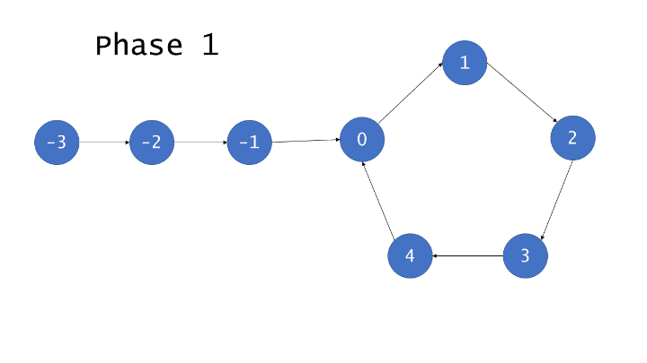

# 题目0141_0142:环形链表

## 题目描述

给定一个链表,判断链表中是否有环。

为了表示给定链表中的环,我们使用整数pos来表示链表尾连接到链表中的位置(索引从0开始)。 如果pos是-1,则在该链表中没有环。

 

示例 1:

```
输入：head = [3,2,0,-4], pos = 1
输出：true
解释：链表中有一个环，其尾部连接到第二个节点。
```


示例 2:

```
输入：head = [1,2], pos = 0
输出：true
解释：链表中有一个环，其尾部连接到第一个节点。
```


示例 3:

```
输入：head = [1], pos = -1
输出：false
解释：链表中没有环。
```


 
## 解题技巧

* **方法一:哈希表**

思路:我们可以通过检查一个结点此前是否被访问过来判断链表是否为环形链表。常用的方法是使用哈希表。用一个Set保存已经访问过的节点,可以遍历整个列表并返回第一个出现重复的节点。

算法:首先,我们分配一个Set去保存所有的列表节点。我们逐一遍历列表,检查当前节点是否出现过,如果节点已经出现过,那么一定形成了环且它是环的入口。否则如果有其他点是环的入口,我们应该先访问到其他节点而不是这个节点。其他情况,没有成环则直接返回null 。

算法会在遍历有限个节点后终止,这是因为输入列表会被分成两类:成环的和不成环的。一个不成欢的列表在遍历完所有节点后会到达null-即链表的最后一个元素后停止。一个成环列表可以想象成是一个不成环列表将最后一个null元素换成环的入口。

如果while循环终止,我们返回null因为我们已经将所有的节点遍历了一遍且没有遇到重复的节点,这种情况下,列表是不成环的。对于循环列表,while循环永远不会停止,但在某个节点上,if条件会被满足并导致函数的退出。


```python
# Definition for singly-linked list.
# class ListNode(object):
#     def __init__(self, x):
#         self.val = x
#         self.next = None

class Solution(object):
    def detectCycle(self, head):
        visited = set()

        node = head
        while node is not None:
            if node in visited:
                return node
            else:
                visited.add(node)
                node = node.next

        return None
```

复杂度分析

> 时间复杂度:O(n),不管是成环还是不成环的输入,算法肯定都只会访问每个节点一次。对于非成环列表这是显而易见的,因为第n个节点指向null,这会让循环退出。对于循环列表,if条件满足时会导致函数的退出,因为它指向了某个已经访问过的节点。两种情况下,访问的节点数最多都是n个,所以运行时间跟节点数目成线性关系。
> 
> 空间复杂度:O(n),不管成环或者不成欢的输入,我们都需要将每个节点插入Set中一次。两者唯一的区别是最后访问的节点后是null还是一个已经访问过的节点。因此,由于Set包含n个不同的节点,所需空间与节点数目也是线性关系的。


* **方法 2:Floyd算法**

想法:当然一个跑得快的人和一个跑得慢的人在一个圆形的赛道上赛跑,会发生什么?在某一个时刻,跑得快的人一定会从后面赶上跑得慢的人。

算法:Floyd的算法被划分成两个不同的阶段。在第一阶段,找出列表中是否有环,如果没有环,可以直接返回null并退出。否则,用 相遇节点来找到环的入口。

**阶段1**

这里我们初始化两个指针-快指针和慢指针。我们每次移动慢指针一步、快指针两步,直到快指针无法继续往前移动。如果在某次移动后,快慢指针指向了同一个节点,我们就返回它。否则,我们继续,直到while循环终止且没有返回任何节点,这种情况说明没有成环,我们返回null。

下图说明了这个算法的工作方式：


环中的节点从0到C-1编号,其中C是环的长度。非环节点从−F到−1编号,其中F是环以外节点的数目。F次迭代以后,慢指针指向了0且快指针指向某个节点h,其中$F \equiv h \pmod C$。这是因为快指针在F次迭代中遍历了2F个节点,且恰好有F个在环中。继续迭代C−h次,慢指针显然指向第C−h号节点,而快指针也会指向相同的节点。原因在于,快指针从h号节点出发遍历了2(C-h)个节点。

$$\begin{aligned} h + 2(C-h) &= 2C - h \\ &\equiv C-h \pmod C \end{aligned}$$

因此,如果列表是有环的,快指针和慢指针最后会同时指向同一个节点,因此被称为相遇 。

* **阶段2**

给定阶段1找到的相遇点,阶段2将找到环的入口。首先我们初始化额外的两个指针:ptr1,指向链表的头,ptr2指向相遇点。然后,我们每次将它们往前移动一步,直到它们相遇,它们相遇的点就是环的入口,返回这个节点。

下面的图将更好的帮助理解和证明这个方法的正确性。


我们利用已知的条件:慢指针移动1步,快指针移动2步,来说明它们相遇在环的入口处。(下面证明中的tortoise表示慢指针,hare表示快指针)

$$\begin{aligned} 2 \cdot distance(tortoise) &= distance(hare) \\ 2(F+a) &= F+a+b+a \\ 2F+2a &= F+2a+b \\ F &= b \\ \end{aligned}$$

因为F=b,指针从h点出发和从链表的头出发,最后会遍历相同数目的节点后在环的入口处相遇。

下面的动画中动态地演示了整个算法过程：



```python
# Definition for singly-linked list.
# class ListNode:
#     def __init__(self, x):
#         self.val = x
#         self.next = None
class Solution(object):
    def getIntersect(self, head):
        tortoise = head
        hare = head

        # A fast pointer will either loop around a cycle and meet the slow
        # pointer or reach the `null` at the end of a non-cyclic list.
        while hare is not None and hare.next is not None:
            tortoise = tortoise.next
            hare = hare.next.next
            if tortoise == hare:
                return tortoise

        return None

    def detectCycle(self, head):
        if head is None:
            return None

        # If there is a cycle, the fast/slow pointers will intersect at some
        # node. Otherwise, there is no cycle, so we cannot find an e***ance to
        # a cycle.
        intersect = self.getIntersect(head)
        if intersect is None:
            return None

        # To find the e***ance to the cycle, we have two pointers traverse at
        # the same speed -- one from the front of the list, and the other from
        # the point of intersection.
        ptr1 = head
        ptr2 = intersect
        while ptr1 != ptr2:
            ptr1 = ptr1.next
            ptr2 = ptr2.next

        return ptr1
```

复杂度分析

> 时间复杂度:O(n),对有环列表,快指针和慢指针在F+C-h次迭代以后会指向同一个节点,正如上面正确性证明所示,$F+C-h \leq F+C = n$,所以阶段1运行时间在O(n)时间以内,阶段2运行F < n次迭代,所以它运行时间也在O(n)以内。对于无环链表,快指针大约需要迭代$\dfrac{n}{2}$次会抵达链表的尾部,这样不会进入阶段2就直接退出。因此,不管是哪一类链表,都会在与节点数成线性关系的时间内运行完。
> 
> 空间复杂度:O(1)。Floyd的快慢指针算法仅需要几个指针,所以只需常数级别的额外空间。
