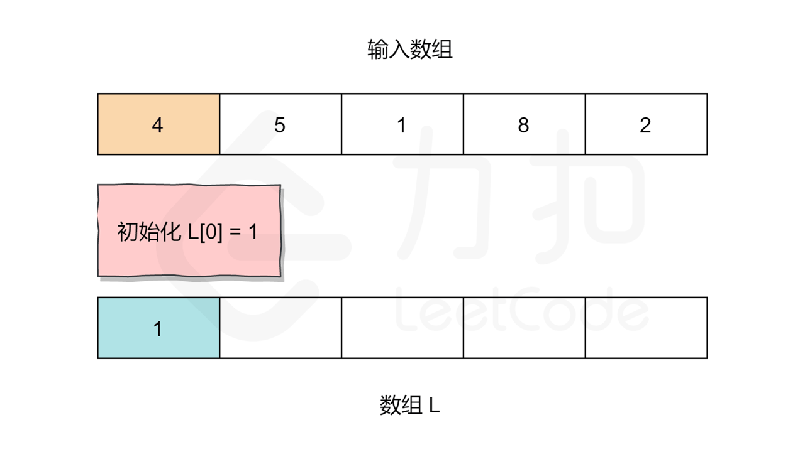

# 题目0238:除自身以外数组的乘积
## 题目描述

给你一个长度为n的整数数组nums,其中n > 1,返回输出数组output,其中output[i]等于nums中除nums[i]之外其余各元素的乘积。

示例:

```
输入: [1,2,3,4]
输出: [24,12,8,6]
```

提示:题目数据保证数组之中任意元素的全部前缀元素和后缀(甚至是整个数组)的乘积都在32位整数范围内。

说明: 请不要使用除法,且在O(n)时间复杂度内完成此题。

进阶:你可以在常数空间复杂度内完成这个题目吗?(出于对空间复杂度分析的目的,输出数组不被视为额外空间。)

## 解题技巧

<video src="../images/e7b8441cbfe24c52bd5043cf8ae9909224eb7284751b01d296ad4f29aa659696.mp4" controls />
 
* **方法一:左右乘积列表**

思路:我们不必将所有数字的乘积除以给定索引处的数字得到相应的答案,而是利用索引左侧所有数字的乘积和右侧所有数字的乘积(即前缀与后缀)相乘得到答案。

对于给定索引i,我们将使用它左边所有数字的乘积乘以右边所有数字的乘积。下面让我们更加具体的描述这个算法。

算法

> 初始化两个空数组L和R。对于给定索引i,L[i]代表的是i左侧所有数字的乘积,R[i]代表的是i右侧所有数字的乘积。
> 
> 我们需要用两个循环来填充L和R数组的值。对于数组L,L[0]应该是1,因为第一个元素的左边没有元素。对于其他元素:L[i] = L[i-1] * nums[i-1]。
> 
> 同理,对于数组 R,R[length-1]应为1。length指的是输入数组的大小。其他元素:R[i] = R[i+1] * nums[i+1]。
> 
> 当R和L数组填充完成,我们只需要在输入数组上迭代,且索引i处的值为:L[i] * R[i]。

让我们用以下图片看看算法是如何工作的:



```python
class Solution:
    def productExceptSelf(self, nums: List[int]) -> List[int]:
        length = len(nums)
        
        # L 和 R 分别表示左右两侧的乘积列表
        L, R, answer = [0]*length, [0]*length, [0]*length
        
        # L[i] 为索引 i 左侧所有元素的乘积
        # 对于索引为 '0' 的元素，因为左侧没有元素，所以 L[0] = 1
        L[0] = 1
        for i in range(1, length):
            L[i] = nums[i - 1] * L[i - 1]
        
        # R[i] 为索引 i 右侧所有元素的乘积
        # 对于索引为 'length-1' 的元素，因为右侧没有元素，所以 R[length-1] = 1
        R[length - 1] = 1
        for i in reversed(range(length - 1)):
            R[i] = nums[i + 1] * R[i + 1]

        # 对于索引 i，除 nums[i] 之外其余各元素的乘积就是左侧所有元素的乘积乘以右侧所有元素的乘积
        for i in range(length):
            answer[i] = L[i] * R[i]
        
        return answer
```

复杂度分析

> 时间复杂度:O(N),其中N指的是数组nums的大小。预处理L和R数组以及最后的遍历计算都是O(N)的时间复杂度。
> 
> 空间复杂度:O(N),其中N指的是数组nums的大小。使用了L和R数组去构造答案,L和R数组的长度为数组nums的大小。

* **方法二:空间复杂度O(1)的方法**

思路:尽管上面的方法已经能够很好的解决这个问题,但是空间复杂度并不为常数。

由于输出数组不算在空间复杂度内,那么我们可以将L或R数组用输出数组来计算。先把输出数组当作L数组来计算,然后再动态构造R数组得到结果。让我们来看看基于这个思想的算法。

算法

> 初始化answer数组,对于给定索引i,answer[i]代表的是i左侧所有数字的乘积。
> 
> 构造方式与之前相同,只是我们试图节省空间,先把answer作为方法一的L数组。
> 
> 这种方法的唯一变化就是我们没有构造R数组。而是用一个遍历来跟踪右边元素的乘积。并更新数组answer[i]=answer[i]*R。然后R更新为R=R*nums[i],其中变量R表示的就是索引右侧数字的乘积。

```python
class Solution:
    def productExceptSelf(self, nums: List[int]) -> List[int]:
        length = len(nums)
        answer = [0]*length
        
        # answer[i] 表示索引 i 左侧所有元素的乘积
        # 因为索引为 '0' 的元素左侧没有元素， 所以 answer[0] = 1
        answer[0] = 1
        for i in range(1, length):
            answer[i] = nums[i - 1] * answer[i - 1]
        
        # R 为右侧所有元素的乘积
        # 刚开始右边没有元素，所以 R = 1
        R = 1;
        for i in reversed(range(length)):
            # 对于索引 i，左边的乘积为 answer[i]，右边的乘积为 R
            answer[i] = answer[i] * R
            # R 需要包含右边所有的乘积，所以计算下一个结果时需要将当前值乘到 R 上
            R *= nums[i]
        
        return answer
```

复杂度分析

> 时间复杂度:O(N),其中N指的是数组nums的大小。分析与方法一相同。
> 
> 空间复杂度:O(1),输出数组不算进空间复杂度中,因此我们只需要常数的空间存放变量。