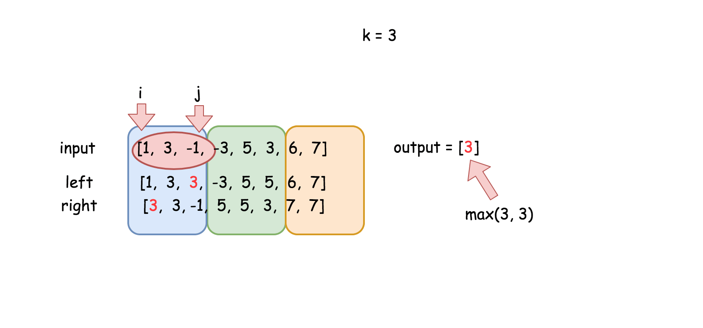

# 题目0239:滑动窗口最大值

## 题目描述

给定一个数组nums,有一个大小为k的滑动窗口从数组的最左侧移动到数组的最右侧。你只可以看到在滑动窗口内的k个数字。滑动窗口每次只向右移动一位。

返回滑动窗口中的最大值。

进阶:你能在线性时间复杂度内解决此题吗?
 

示例:

```
输入: nums = [1,3,-1,-3,5,3,6,7], 和 k = 3
输出: [3,3,5,5,6,7] 
解释: 

  滑动窗口的位置                最大值
---------------               -----
[1  3  -1] -3  5  3  6  7       3
 1 [3  -1  -3] 5  3  6  7       3
 1  3 [-1  -3  5] 3  6  7       5
 1  3  -1 [-3  5  3] 6  7       5
 1  3  -1  -3 [5  3  6] 7       6
 1  3  -1  -3  5 [3  6  7]      7
```


提示:

> 1 <= nums.length <= 10^5
> 
> -10^4 <= nums[i] <= 10^4
> 
> 1 <= k <= nums.length

## 解题技巧

* **方法一:暴力法**

最简单直接的方法是遍历每个滑动窗口,找到每个窗口的最大值。一共有N-k+1个滑动窗口,每个有k个元素,于是算法的时间复杂度为O(Nk),表现较差。

实现

```python
class Solution:
    def maxSlidingWindow(self, nums: 'List[int]', k: 'int') -> 'List[int]':
        n = len(nums)
        if n * k == 0:
            return []
        
        return [max(nums[i:i + k]) for i in range(n - k + 1)]
```

复杂度分析

> 时间复杂度:${O}(N k)$。其中N为数组中元素个数。
>
> 空间复杂度:${O}(N - k + 1)$,用于输出数组。

* **方法二:双向队列**

如何优化时间复杂度呢?首先想到的是使用堆,因为在最大堆中heap[0]永远是最大的元素。在大小为k的堆中插入一个元素消耗$\log(k)$时间,因此算法的时间复杂度为${O}(N \log(k))$。

能否得到只要${O}(N)$的算法?

我们可以使用双向队列,该数据结构可以从两端以常数时间压入/弹出元素。

存储双向队列的索引比存储元素更方便,因为两者都能在数组解析中使用。

算法,算法非常直截了当:

> - 处理前k个元素,初始化双向队列。
> - 遍历整个数组。在每一步清理双向队列:
>   + 只保留当前滑动窗口中有的元素的索引。
>   + 移除比当前元素小的所有元素,它们不可能是最大的。
> - 将当前元素添加到双向队列中。
> - 将deque[0]添加到输出中。
> - 返回输出数组。

实现

```python
from collections import deque
class Solution:
    def maxSlidingWindow(self, nums: 'List[int]', k: 'int') -> 'List[int]':
        # base cases
        n = len(nums)
        if n * k == 0:
            return []
        if k == 1:
            return nums
        
        def clean_deque(i):
            # remove indexes of elements not from sliding window
            if deq and deq[0] == i - k:
                deq.popleft()
                
            # remove from deq indexes of all elements 
            # which are smaller than current element nums[i]
            while deq and nums[i] > nums[deq[-1]]:
                deq.pop()
        
        # init deque and output
        deq = deque()
        max_idx = 0
        for i in range(k):
            clean_deque(i)
            deq.append(i)
            # compute max in nums[:k]
            if nums[i] > nums[max_idx]:
                max_idx = i
        output = [nums[max_idx]]
        
        # build output
        for i in range(k, n):
            clean_deque(i)          
            deq.append(i)
            output.append(nums[deq[0]])
        return output
```

复杂度分析

> 时间复杂度:${O}(N)$,每个元素被处理两次-其索引被添加到双向队列中和被双向队列删除。
> 
> 空间复杂度:${O}(N)$,输出数组使用了${O}(N - k + 1)$空间,双向队列使用了${O}(k)$。

* **方法三:动态规划**

这是另一个O(N)的算法。本算法的优点是不需要使用数组/列表之外的任何数据结构。

算法的思想是将输入数组分割成有k个元素的块。若n%k != 0,则最后一块的元素个数可能更少。


开头元素为i,结尾元素为j的当前滑动窗口可能在一个块内,也可能在两个块中。


情况1比较简单。建立数组left,其中left[j]是从块的开始到下标j最大的元素,方向左->右。


为了处理更复杂的情况2,我们需要数组right,其中right[j]是从块的结尾到下标j最大的元素,方向右->左。right数组和left除了方向不同以外基本一致。


两数组一起可以提供两个块内元素的全部信息。考虑从下标i到下标j的滑动窗口。根据定义,right[i]是左侧块内的最大元素,left[j]是右侧块内的最大元素。因此滑动窗口中的最大元素为max(right[i], left[j])。


算法,算法十分直截了当:

> - 从左到右遍历数组,建立数组 left。
> - 从右到左遍历数组,建立数组 right。

建立输出数组max(right[i], left[i + k - 1]),其中i取值范围为(0, n - k + 1)。



实现:

```python
class Solution:
    def maxSlidingWindow(self, nums: 'List[int]', k: 'int') -> 'List[int]':
        n = len(nums)
        if n * k == 0:
            return []
        if k == 1:
            return nums
        
        left = [0] * n
        left[0] = nums[0]
        right = [0] * n
        right[n - 1] = nums[n - 1]
        for i in range(1, n):
            # from left to right
            if i % k == 0:
                # block start
                left[i] = nums[i]
            else:
                left[i] = max(left[i - 1], nums[i])
            # from right to left
            j = n - i - 1
            if (j + 1) % k == 0:
                # block end
                right[j] = nums[j]
            else:
                right[j] = max(right[j + 1], nums[j])
        
        output = []
        for i in range(n - k + 1):
            output.append(max(left[i + k - 1], right[i]))
            
        return output
```

复杂度分析

> 时间复杂度:O(N),我们对长度为N的数组处理了3次。
> 
> 空间复杂度:O(N),用于存储长度为N的left和right数组,以及长度为N-k+1的输出数组。