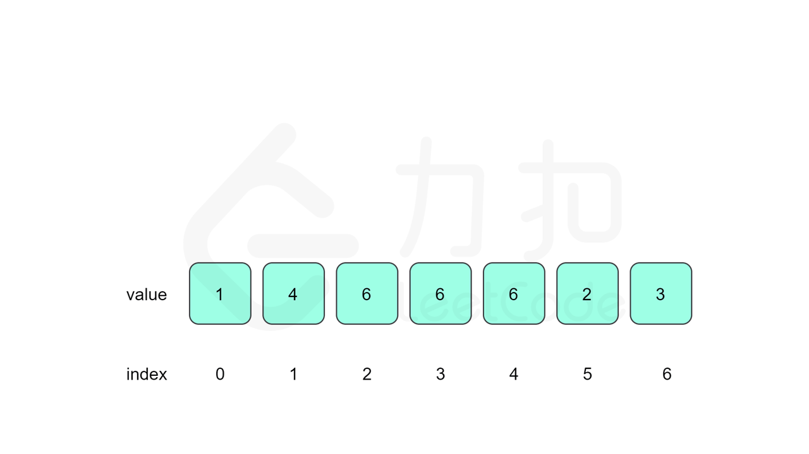

# 题目0287:寻找重复数

## 题目描述

给定一个包含n+1个整数的数组nums,其数字都在1到n之间(包括1和n),可知至少存在一个重复的整数。假设只有一个重复的整数,找出这个重复的数。

示例1:

```
输入: [1,3,4,2,2]
输出: 2
```

示例2:

```
输入: [3,1,3,4,2]
输出: 3
```

说明:

> 不能更改原数组(假设数组是只读的)。
> 
> 只能使用额外的O(1)的空间。
> 
> 时间复杂度小于$O(n^2)$。
> 
> 数组中只有一个重复的数字，但它可能不止重复出现一次。

## 解题技巧

<video src="../images/366449e338fb4a6b9a71b89beb3726f83429e0277bac43d0ddbaabd50efbed44.mp4" controls /> 

* **方法一:二分查找**

思路和算法:我们定义$\textit{cnt}[i]$表示$\textit{nums}[]$数组中小于等于i的数有多少个,假设我们重复的数是$\textit{target}$,那么[1,target−1]里的所有数满足$\textit{cnt}[i]\le i$,[target,n]里的所有数满足$\textit{cnt}[i]>i$具有单调性。

以示例1为例,我们列出每个数字的cnt值:


| nums | 1  | 2 | 3 | 4 |
| :--- | :--- | :--- | :--- | :--- |
| cnt | 1 | 3  | 4  | 5 |

示例中重复的整数是2,我们可以看到[1,1]中的数满足$\textit{cnt}[i]\le i$,[2,4]中的数满足$\textit{cnt}[i]>i$。

如果知道$\textit{cnt}[]$数组随数字i逐渐增大具有单调性(即target前$\textit{cnt}[i]\le i$,target后$\textit{cnt}[i]>i$),那么我们就可以直接利用二分查找来找到重复的数。

但这个性质一定是正确的吗?考虑$\textit{nums}[]$数组一共有n+1个位置,我们填入的数字都在[1,n]间,有且只有一个数重复放了两次以上。对于所有测试用例,考虑以下两种情况:

如果测试用例的数组中target出现了两次,其余的数各出现了一次,这个时候肯定满足上文提及的性质,因为小于target的数i满足$\textit{cnt}[i]=i$,大于等于target的数j满足$cnt[j]=j+1$。

如果测试用例的数组中target出现了三次及以上,那么必然有一些数不在$\textit{nums}[]$数组中了,这个时候相当于我们用target去替换了这些数,我们考虑替换的时候对$\textit{cnt}[]$数组的影响。如果替换的数i小于target,那么[i,target−1]的cnt值均减一,其他不变,满足条件。如果替换的数j大于等于target,那么[target,j−1]的cnt值均加一,其他不变,亦满足条件。

因此我们生成的数组一定具有上述性质的。

```python
class Solution {
public:
    int findDuplicate(vector<int>& nums) {
        int n = nums.size();
        int l = 1, r = n - 1, ans = -1;
        while (l <= r) {
            int mid = (l + r) >> 1;
            int cnt = 0;
            for (int i = 0; i < n; ++i) {
                cnt += nums[i] <= mid;
            }
            if (cnt <= mid) {
                l = mid + 1;
            } else {
                r = mid - 1;
                ans = mid;
            }
        }
        return ans;
    }
};
```

复杂度分析

> 时间复杂度:$O(n\log n)$,其中n为nums[]数组的长度。二分查找最多需要二分$O(\log n)$次,每次判断的时候需要O(n)遍历nums[]数组求解小于等于mid的数的个数,因此总时间复杂度为$O(n\log n)$。
> 
> 空间复杂度:$O(1)$。我们只需要常数空间存放若干变量。

* **方法二:二进制**

思路和算法:这个方法我们来将所有数二进制展开按位考虑如何找出重复的数,如果我们能确定重复数每一位是1还是0就可以按位还原出重复的数是什么。

考虑到第i位，我们记nums[]数组中二进制展开后第i位为1的数有x个,数字[1,n]这n个数二进制展开后第i位为1的数有y个,那么重复的数第i位为1当且仅当x>y。

仍然以示例1为例,如下的表格列出了每个数字二进制下每一位是1还是0以及对应位的x和y是多少:

| | 1 | 3 | 4 | 2 | 2 | x | y |
| :--- | :--- | :--- | :--- | :--- | :--- | :--- | :--- |
| 第0位 | 1 | 1 | 0 | 0 | 0 | 2 | 2 |
| 第1位 | 0 | 1 | 0 | 1 | 1 | 3 | 2 |
| 第2位 | 0 | 0 | 1 | 0 | 0 | 1 | 1 |

那么按之前说的我们发现只有第1位x>y,所以按位还原后$\textit{target}=(010)_2=(2)_{10}$,符合答案。

正确性的证明其实和方法一类似,我们可以按方法一的方法,考虑不同示例数组中第i位1的个数x的变化:

> 如果测试用例的数组中target出现了两次,其余的数各出现了一次,且target的第i位为1,那么nums[]数组中第i位1的个数x恰好比y大一。如果target的第i位为0,那么两者相等。
> 
> 如果测试用例的数组中target出现了三次及以上,那么必然有一些数不在nums[]数组中了,这个时候相当于我们用target去替换了这些数,我们考虑替换的时候对x的影响:
>   - 如果被替换的数第i位为1,且target第i位为1:x不变,满足x>y。
>   - 如果被替换的数第i位为0,且target第i位为1:x加一,满足x>y。
>   - 如果被替换的数第i位为1,且target第i位为0:x减一,满足$x\le y$。
>   - 如果被替换的数第i位为0,且target第i位为0:x不变,满足$x\le y$。

也就是说如果target第i位为1,那么每次替换后只会使x不变或增大,如果为0,只会使x不变或减小,始终满足$x>y$时target第i位为1,否则为0,因此我们只要按位还原这个重复的数即可。

```c++
class Solution {
public:
    int findDuplicate(vector<int>& nums) {
        int n = nums.size(), ans = 0;
        // 确定二进制下最高位是多少
        int bit_max = 31;
        while (!((n - 1) >> bit_max)) {
            bit_max -= 1;
        }
        for (int bit = 0; bit <= bit_max; ++bit) {
            int x = 0, y = 0;
            for (int i = 0; i < n; ++i) {
                if (nums[i] & (1 << bit)) {
                    x += 1;
                }
                if (i >= 1 && (i & (1 << bit))) {
                    y += 1;
                }
            }
            if (x > y) {
                ans |= 1 << bit;
            }
        }
        return ans;
    }
};
```

复杂度证明

> 时间复杂度:$O(n\log n)$,其中n为nums[]数组的长度。$O(\log n)$代表了我们枚举二进制数的位数个数,枚举第i位的时候需要遍历数组统计x和y的答案,因此总时间复杂度为$O(n\log n)$。
>
> 空间复杂度:O(1)。我们只需要常数空间存放若干变量。

* **方法三:快慢指针**

预备知识:本方法需要读者对Floyd 判圈算法(又称龟兔赛跑算法)有所了解,它是一个检测链表是否有环的算法,LeetCode中相关例题有141环形链表,142环形链表II。

**思路和算法**

我们对nums[]数组建图,每个位置i连一条$i\rightarrow \textit{nums}[i]$的边。由于存在的重复的数字target,因此target这个位置一定有起码两条指向它的边,因此整张图一定存在环,且我们要找到的target就是这个环的入口,那么整个问题就等价于142环形链表II。

我们先设置慢指针slow 和快指针fast,慢指针每次走一步,快指针每次走两步,根据Floyd 判圈算法两个指针在有环的情况下一定会相遇,此时我们再将slow放置起点0,两个指针每次同时移动一步,相遇的点就是答案。



这里简单解释为什么后面将slow放置起点后移动相遇的点就一定是答案了。假设环长为L,从起点到环的入口的步数是a,从环的入口继续走b步到达相遇位置,从相遇位置继续走c步回到环的入口,则有b+c=L,其中L、a、b、c都是正整数。根据上述定义,慢指针走了a+b步,快指针走了2(a+b)步。从另一个角度考虑,在相遇位置,快指针比慢指针多走了若干圈,因此快指针走的步数还可以表示成a+b+kL,其中k表示快指针在环上走的圈数。联立等式,可以得到`2(a+b)=a+b+kL`,

解得`a=kL-b`,整理可得`a=(k-1)L+(L-b)=(k-1)L+c`。

从上述等式可知,如果慢指针从起点出发,快指针从相遇位置出发,每次两个指针都移动一步,则慢指针走了a步之后到达环的入口,快指针在环里走了k−1圈之后又走了c步,由于从相遇位置继续走c步即可回到环的入口,因此快指针也到达环的入口。两个指针在环的入口相遇,相遇点就是答案。

```c++
class Solution {
public:
    int findDuplicate(vector<int>& nums) {
        int slow = 0, fast = 0;
        do {
            slow = nums[slow];
            fast = nums[nums[fast]];
        } while (slow != fast);
        slow = 0;
        while (slow != fast) {
            slow = nums[slow];
            fast = nums[fast];
        }
        return slow;
    }
};
```

复杂度分析

> 时间复杂度:O(n)。Floyd判圈算法时间复杂度为线性的时间复杂度。
> 
> 空间复杂度:O(1)。我们只需要常数空间存放若干变量。